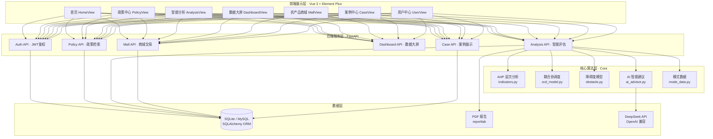
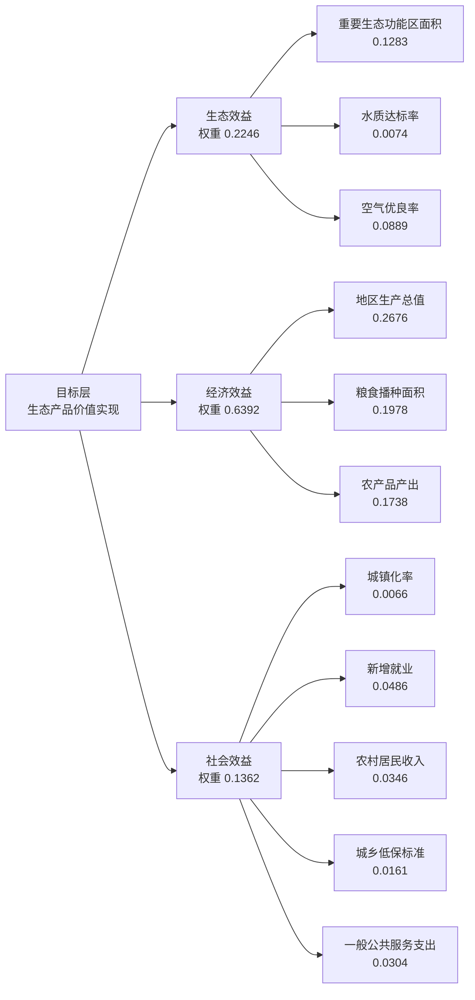
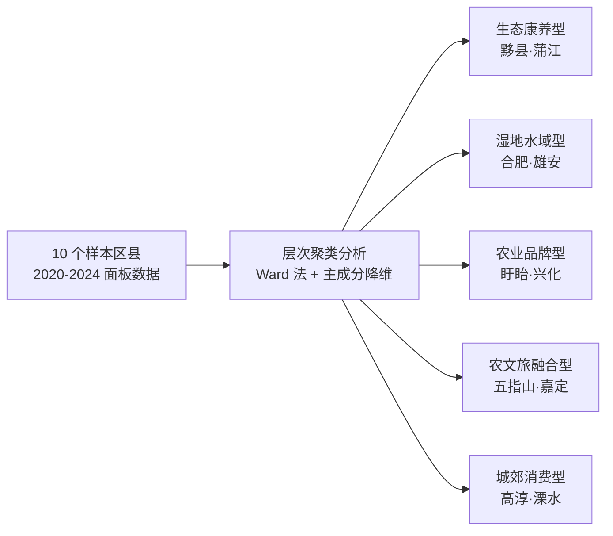
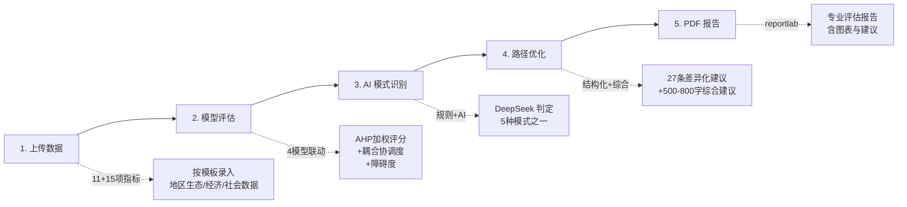
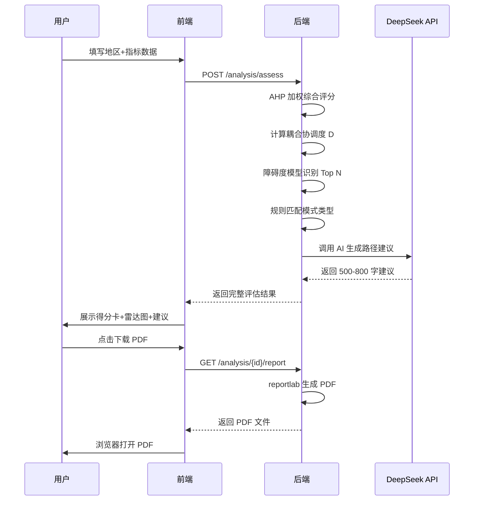
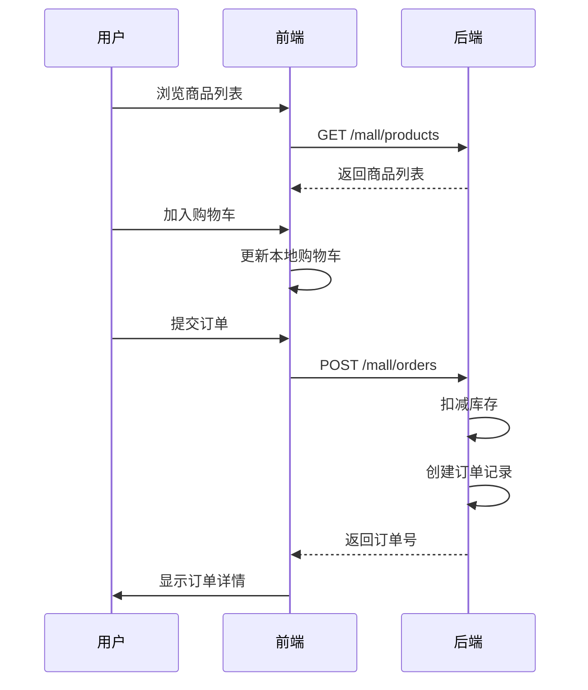

# 绿脉兴农 · 平台功能说明文档

> **生态产品价值实现赋能乡村振兴一体化智能系统**
>
> 中国研究生乡村振兴科技强农+创新大赛参赛作品 · 南京师范大学绿脉兴农团队

---

## 一、平台概述

### 1.1 平台定位

绿脉兴农是一个面向地方政府、农业合作社、研究学者的**一站式生态产品价值实现决策支持平台**。平台基于 AHP 层次分析、熵权法、耦合协调度、障碍度四大数学模型，结合 DeepSeek AI 大模型，将"绿水青山"的价值**算得清、看得见、走得通**。

### 1.2 核心价值

| 维度 | 能力 |
|------|------|
| 算得清 | 11 项生态产品价值实现指标 + 15 项乡村振兴指标，AHP 组合权重加权综合评分 |
| 看得见 | 10 区县 5 年面板数据可视化大屏，5 种模式横向对比与时间演化 |
| 走得通 | AI 智能识别所属模式 → 27 条差异化路径优化建议 → PDF 报告一键导出 |

### 1.3 核心数据

- **5** 种生态产品价值实现发展模式
- **4** 大数学评估模型
- **27** 项核心评估指标
- **10** 个典型样本区县（覆盖江苏、浙江、安徽、四川）
- **5** 年时间序列数据（2020-2024）

---

## 二、系统架构

### 2.1 整体架构



### 2.2 技术栈

| 层级 | 技术选型 | 用途 |
|------|---------|------|
| 前端框架 | Vue 3 + Composition API | 响应式视图层 |
| UI 组件 | Element Plus | 企业级组件库 |
| 图表库 | ECharts | 数据可视化 |
| 构建工具 | Vite | 极速热更新 |
| 后端框架 | FastAPI | 高性能异步 API |
| ORM | SQLAlchemy | 数据库抽象层 |
| 数据库 | SQLite → MySQL | 数据持久化 |
| 鉴权 | JWT (python-jose + passlib) | 无状态身份认证 |
| AI | DeepSeek API | 大模型路径优化 |
| PDF | reportlab | 报告生成 |

---

## 三、核心方法论

平台融合 **4 大数学模型** + **1 个 AI 引擎**，构建从数据到决策的完整闭环。

### 3.1 AHP 层次分析法

> 构建"目标层—准则层—指标层"三级递阶结构，通过专家判断矩阵计算组合权重。



**指标体系覆盖：**

| 体系 | 指标数 | 准则层 | 关键指标 |
|------|--------|--------|---------|
| 生态产品价值实现成效 | 11 项 | 生态/经济/社会效益 | 重要生态功能区面积、GDP、空气优良率 |
| 乡村振兴水平 | 15 项 | 产业/生态/乡风/治理/生活 | 粮食总产、森林覆盖率、农村人均收入 |

### 3.2 耦合协调度模型（CCD）

> 测算两大系统的耦合协调度 D∈[0,1]，划分 10 级协调等级。

```
耦合度：    C = 2·√(U1·U2) / (U1 + U2)
协调指数：  T = α·U1 + β·U2     (α=β=0.5)
耦合协调度：D = √(C·T)
```

**10 级划分标准：**

| D 值区间 | 等级 | 颜色 |
|---------|------|------|
| [0.0, 0.1) | 极度失调 | 深红 |
| [0.1, 0.2) | 严重失调 | 红 |
| [0.2, 0.3) | 中度失调 | 橙红 |
| [0.3, 0.4) | 轻度失调 | 橙 |
| [0.4, 0.5) | 濒临失调 | 黄 |
| [0.5, 0.6) | 勉强协调 | 浅黄 |
| [0.6, 0.7) | 初级协调 | 浅绿 |
| [0.7, 0.8) | 中级协调 | 绿 |
| [0.8, 0.9) | 良好协调 | 深绿 |
| [0.9, 1.0] | 优质协调 | 翠绿 |

### 3.3 障碍度模型

> 识别制约协同发展的关键障碍因子，定位改进优先方向。

```
指标偏离度 = 1 - 归一化值
障碍度 = 偏离度 × 权重
按障碍度降序排列，取 Top N 因子
```

### 3.4 DeepSeek AI 智能引擎

> 基于模式识别结果，调用大模型生成 500-800 字差异化路径优化建议。

- **输入**：地区指标数据 + 4 模型评估结果 + 模式判定
- **输出**：结构化路径优化建议 + AI 综合建议
- **兜底**：未配置 API Key 时使用规则版建议，仍可完整演示

---

## 四、功能模块详解

### 4.1 首页（HomeView）

平台门户与品牌展示，介绍核心方法论、四种功能、五种模式、评估流程。

| 区块 | 内容 |
|------|------|
| Hero 区 | 品牌标识、参赛信息、核心数据（5模式/4模型/27指标/AI） |
| 核心方法论 | AHP / 熵权法 / 耦合协调度 / 障碍度 四模型卡片 |
| 四大功能 | 政策中心 / 智能分析 / 农产品商城 / 案例中心 |
| 五种模式 | 模式名称、识别阈值、路径优化方向 |
| 评估流程 | 上传数据→模型评估→AI识别→路径优化→PDF报告 五步流程 |

### 4.2 政策中心（PolicyView）

汇集国家级、省级、地市级乡村振兴与生态产品价值实现相关政策。

**功能要点：**

- **多维检索**：主题分类（生态补偿/产业发展/人才振兴等）+ 政策级别 + 关键词搜索
- **统计概览**：政策总数、国家级、省级、地市级数量统计卡
- **杂志式列表**：序号、分类标签、级别标签、发布地区、发布日期、政策摘要
- **分页加载**：支持翻页浏览大量政策

### 4.3 智能分析中心（AnalysisView）⭐核心模块

平台的核心功能模块，包含 3 个标签页，覆盖完整评估闭环。

#### Tab 1：综合评估

完整的智能评估工作流，左侧录入数据，右侧展示结果。

**输入区**：
- 地区名称、评估年份
- 11 项生态产品价值实现指标
- 15 项乡村振兴水平指标
- "加载模板"按钮一键填充指标结构

**结果展示区**：

| 卡片 | 内容 |
|------|------|
| 综合得分卡 | 生态产品得分 / 乡村振兴得分（0-100）+ 进度条 |
| 耦合协调度 | D 值 + 10 级协调等级标签 |
| AI 模式识别 | 模式名称 + 识别理由 + AI 印章 |
| 模式识别标准 | 模式特征标签 + 核心要素列表 + 量化阈值表 |
| 维度雷达图 | 8 维度（生态/经济/社会/产业/生态/乡风/治理/生活）双系统对比 |
| 障碍因子图 | Top 5 障碍因子横向条形图（按障碍度排序） |
| 结构化建议 | 27 条差异化路径优化建议（按模式匹配） |
| AI 综合建议 | DeepSeek 生成的 500-800 字综合建议 |
| PDF 导出 | 一键下载专业评估报告 |

#### Tab 2：模式识别标准

5 种生态产品价值实现模式的量化识别标准展示，使用手风琴折叠面板。

每种模式包含：
- **代表区县**：如生态康养型代表黟县、蒲江县
- **模式定义**：业态描述
- **模式特点**：资源依赖性、产业延伸性等标签
- **核心要素**：自然资源本底、产业链延伸等要点列表
- **识别阈值**：量化阈值表（指标 / 运算符 / 阈值 / 单位 / 是否必需）

#### Tab 3：耦合协调度工具

独立的耦合协调度计算器，无需上传完整数据即可快速测算。

- **双输入**：生态产品得分 U1（0-100）+ 乡村振兴得分 U2（0-100）
- **实时计算**：输出 C、T、D 三个值 + 等级标签
- **仪表盘**：ECharts gauge 图动态显示 D 值落点
- **等级标准**：10 级划分标准网格展示，当前等级高亮

### 4.4 数据大屏（DashboardView）

10 区县 5 年面板数据的多维可视化分析。

**控制面板**：
- 对比指标切换（生态得分/乡村振兴/D值/森林覆盖率/农村收入/GDP）
- 年份切换（2020-2024）

**统计卡**：
- 样本区县数（10）
- 观察年份（5 年）
- 聚类模式数（5 类）
- 当年最高指标值 + 区县名

**可视化图表**：

| 图表 | 类型 | 说明 |
|------|------|------|
| 横向对比 | 柱状图 | 当年 10 区县按指标降序，按模式分色 |
| 时间演化 | 折线图 | 5 年趋势，按模式分色 |
| 模式雷达 | 雷达图 | 5 模式代表区县五维得分对比 |
| 耦合散点 | 散点图 | 生态得分 vs 振兴得分，对角线为 D=1 |
| AHP 权重 | 横向条形图 | 26 项指标组合权重可视化 |
| 聚类散点 | 散点图 | 10 区县 PC1/PC2 主成分降维坐标 |

### 4.5 农产品商城（MallView）

面向农户与合作社的生态农产品展示与交易平台。

**功能要点：**

- **分类筛选**：茶叶、水果、水产、农副等品类切换
- **关键词搜索**：商品名称模糊搜索
- **商品卡片**：图片、生态认证标签、产地、价格、库存
- **购物车**：抽屉式购物车，支持数量调整、单品删除、合计结算
- **商品上架**：商家角色可上架自有商品（含图片、价格、库存）

### 4.6 案例中心（CaseView）

5 种模式的典型案例展示与学习。

**功能要点：**

- **模式筛选**：5 种模式标签切换
- **案例卡片**：模式标签、地区、标题、摘要
- **详情弹窗**：3 标签页结构化展示
  - **案例详情**：完整案例描述
  - **模式识别标准**：该案例所属模式的量化识别标准
  - **路径优化建议**：27 条差异化建议（按模式匹配）

### 4.7 用户中心（UserView）

注册 / 登录 / 个人面板。

**功能要点：**

- **登录注册**：双标签页切换，支持普通用户 / 商家角色
- **JWT 鉴权**：无状态身份认证
- **个人面板**：评估历史记录、政策收藏、订单管理

---

## 五、五种生态产品价值实现模式

基于层次聚类分析，将 10 个典型区县划分为 5 种模式，每种模式配备量化识别标准与差异化路径优化建议。

### 5.1 模式总览



### 5.2 模式详细对比

| 模式 | 代表区县 | 核心阈值 | 路径方向 |
|------|---------|---------|---------|
| **生态康养型** | 黟县、蒲江 | 森林覆盖率≥65%、城镇化率≤55%、空气优良率≥80% | 森林康养基地、气候疗养产品、康养小镇品牌 |
| **湿地水域型** | 合肥、雄安 | 水质达标率≥95%、重要生态保护区面积突出 | 湿地公园、保水渔业、水权交易、碳汇交易 |
| **农业品牌型** | 盱眙、兴化 | 粮食播种面积≥10万公顷、农产品产出≥90万吨 | 区域公用品牌、三品一标、精深加工产业链 |
| **农文旅融合型** | 五指山、嘉定 | 森林覆盖率≥15%、空气优良率≥80%、文化资源丰富 | 研学线路、文创工坊、乡村节庆、特色民宿 |
| **城郊消费型** | 高淳、溧水 | 城镇化率≥70%、GDP≥1000亿、农村人均收入≥4万元 | 都市农园、采摘体验、城郊综合体、周末经济 |

### 5.3 路径优化建议矩阵

每种模式配备 **5-6 条**结构化路径优化建议，合计 **27 条**。每条建议包含：

- **建议编号**：01-06
- **建议标题**：核心方向（如"建设森林康养基地"）
- **建议详情**：具体实施路径与目标量化

| 模式 | 建议数 | 重点方向示例 |
|------|--------|------------|
| 生态康养型 | 6 条 | 森林康养基地、气候疗养产品、康养小镇 |
| 湿地水域型 | 5 条 | 湿地公园、保水渔业、碳汇交易 |
| 农业品牌型 | 6 条 | 区域公用品牌、三品一标、精深加工 |
| 农文旅融合型 | 5 条 | 研学线路、文创工坊、乡村节庆 |
| 城郊消费型 | 5 条 | 都市农园、采摘体验、城郊综合体 |

---

## 六、智能评估工作流

### 6.1 完整评估流程



### 6.2 数据评估流程



### 6.3 商城交易流程



---

## 七、API 接口总览

### 7.1 鉴权 API（auth.py）

| 端点 | 方法 | 说明 |
|------|------|------|
| `/auth/register` | POST | 用户注册（用户名/邮箱/密码/角色） |
| `/auth/login` | POST | 用户登录，返回 JWT Token |
| `/auth/me` | GET | 获取当前用户信息 |

### 7.2 政策 API（policy.py）

| 端点 | 方法 | 说明 |
|------|------|------|
| `/policy/list` | GET | 政策列表（支持分页/筛选） |
| `/policy/{id}` | GET | 政策详情 |

### 7.3 智能分析 API（analysis.py）⭐

| 端点 | 方法 | 说明 |
|------|------|------|
| `/analysis/template` | GET | 获取指标模板（26 项指标） |
| `/analysis/assess` | POST | 智能评估（核心接口） |
| `/analysis/{id}/report` | GET | 生成 PDF 报告 |
| `/analysis/mode-criteria` | GET | 五种模式识别标准 |
| `/analysis/mode-suggestions/{mode}` | GET | 模式路径优化建议 |
| `/analysis/ahp-weights` | GET | AHP 组合权重 |
| `/analysis/cluster-results` | GET | 10 区县聚类结果 |
| `/analysis/coordination-levels` | GET | 10 级协调等级标准 |
| `/analysis/coupling-calculate` | GET | 耦合协调度计算器 |
| `/analysis/obstacle-diagnose` | POST | 障碍因子诊断 |

### 7.4 数据大屏 API（dashboard.py）

| 端点 | 方法 | 说明 |
|------|------|------|
| `/dashboard/compare` | GET | 区县横向对比数据 |
| `/dashboard/trend` | GET | 5 年时间序列数据 |
| `/dashboard/mode-radar` | GET | 模式雷达图数据 |
| `/dashboard/scatter` | GET | 耦合散点图数据 |
| `/dashboard/weights` | GET | AHP 权重数据 |
| `/dashboard/cluster` | GET | 聚类散点图数据 |

### 7.5 商城 API（mall.py）

| 端点 | 方法 | 说明 |
|------|------|------|
| `/mall/products` | GET | 商品列表 |
| `/mall/products` | POST | 商家上架商品 |
| `/mall/orders` | POST | 创建订单 |

### 7.6 案例 API（case.py）

| 端点 | 方法 | 说明 |
|------|------|------|
| `/case/list` | GET | 案例列表（支持模式筛选） |
| `/case/{id}` | GET | 案例详情 |
| `/case/mode-criteria` | GET | 五种模式标准 |
| `/case/{id}/suggestions` | GET | 案例模式路径建议 |

---

## 八、部署与运行

### 8.1 后端启动

```bash
cd greenpulse/backend
python -m venv venv
venv\Scripts\activate              # Windows
# source venv/bin/activate         # Linux/Mac
pip install -r requirements.txt
python run.py                      # 默认 http://localhost:8000
```

启动后：
- API 文档：http://localhost:8000/docs
- ReDoc 文档：http://localhost:8000/redoc

### 8.2 前端启动

```bash
cd greenpulse/frontend
npm install
npm run dev                        # 默认 http://localhost:5173
npm run build                      # 生产构建到 dist/
```

### 8.3 DeepSeek AI 配置（可选）

```bash
# 编辑 backend/.env
DEEPSEEK_API_KEY=sk-your-key-here
```

未配置时使用规则版建议兜底，仍可完整演示所有功能。

### 8.4 生产部署

| 平台 | 配置文件 | 说明 |
|------|---------|------|
| Railway | `railway.json` | 后端一键部署 |
| Vercel | `vercel.json` | 前端一键部署 |

---

## 九、参赛信息

| 项目 | 信息 |
|------|------|
| 赛事 | 中国研究生乡村振兴科技强农+创新大赛 |
| 团队 | 南京师范大学 · 绿脉兴农团队 |
| 作品 | 生态产品价值实现赋能乡村振兴一体化智能系统 |
| 口号 | 让"绿水青山"看得见、算得清、走得通 |

---

## 附录：核心指标体系

### 生态产品价值实现成效评价指标（11 项）

| 指标 | 准则层 | 权重 |
|------|--------|------|
| 重要生态功能保护区面积（公顷） | 生态效益 | 0.1283 |
| 主要水体水质断面达标率（%） | 生态效益 | 0.0074 |
| 空气环境质量优良率（%） | 生态效益 | 0.0889 |
| 地区生产总值（万元） | 经济效益 | 0.2676 |
| 全区粮食播种面积（公顷） | 经济效益 | 0.1978 |
| 农产品产出（吨） | 经济效益 | 0.1738 |
| 常住人口城镇化率（%） | 社会效益 | 0.0066 |
| 新增就业人数（人） | 社会效益 | 0.0486 |
| 农村居民人均可支配收入（元） | 社会效益 | 0.0346 |
| 城乡低保标准（元/月） | 社会效益 | 0.0161 |
| 一般公共服务支出（万元） | 社会效益 | 0.0304 |

### 乡村振兴水平评价指标（15 项）

| 指标 | 维度 | 权重 |
|------|------|------|
| 粮食总产量（吨） | 产业兴旺 | 0.2140 |
| 农业机械总动力/农作物播种面积 | 产业兴旺 | 0.0288 |
| 农林牧渔业总产值（万元） | 产业兴旺 | 0.1868 |
| 森林覆盖率（%） | 生态宜居 | 0.0416 |
| 污水处理厂集中处理率（%） | 生态宜居 | 0.0211 |
| 农村卫生厕所普及率（%） | 生态宜居 | 0.0091 |
| 普通中学专任教师数/在校学生数（%） | 乡风文明 | 0.0355 |
| 图书馆个数（个） | 乡风文明 | 0.0428 |
| 固定互联网宽带接入用户（户） | 乡风文明 | 0.0274 |
| 农林水事务支出占比（%） | 治理有效 | 0.0545 |
| 卫生室/卫生机构数量（个） | 治理有效 | 0.0217 |
| 三种专利申请授权量（件） | 治理有效 | 0.1352 |
| 农村人均可支配收入（元） | 生活富裕 | 0.1012 |
| 农村人均消费支出（元） | 生活富裕 | 0.0378 |
| 人均道路面积（平方米） | 生活富裕 | 0.0424 |

---

**文档版本**：v1.0
**最后更新**：2026-07-22
**维护团队**：绿脉兴农团队
